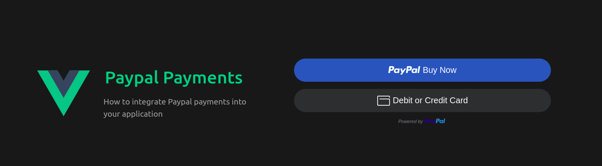
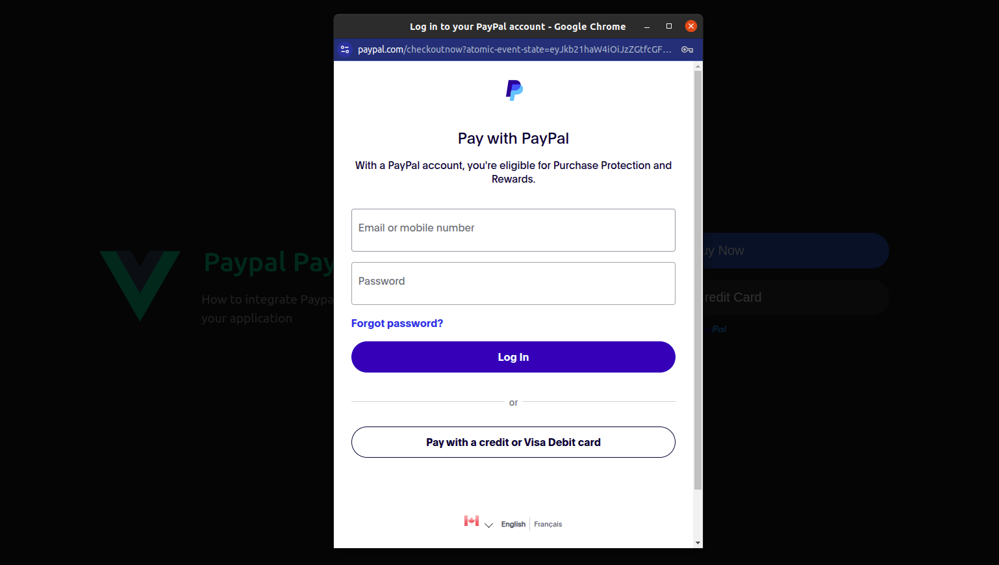
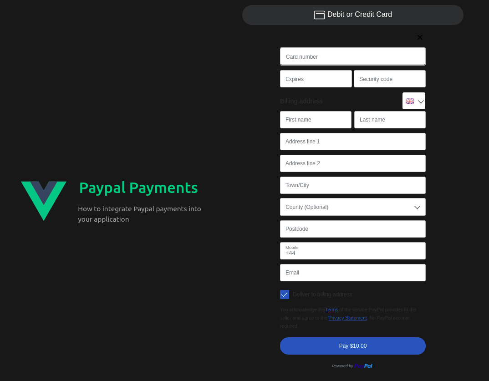

# PayPpal Payments

Add PayPal payment buttons to your Application.

*Author: Yusuf Abouelwafa*

## Payment buttons


## Pay with PayPal


## Pay with Credit Card


# Recommended IDE Setup

[VSCode](https://code.visualstudio.com/) + [Volar](https://marketplace.visualstudio.com/items?itemName=Vue.volar) (and disable Vetur).

# Customize configuration

See [Vite Configuration Reference](https://vite.dev/config/).

## Project Setup

```sh
yarn
```

### Compile and Hot-Reload for Development

```sh
yarn dev
```

### Compile and Minify for Production

```sh
yarn build
```
